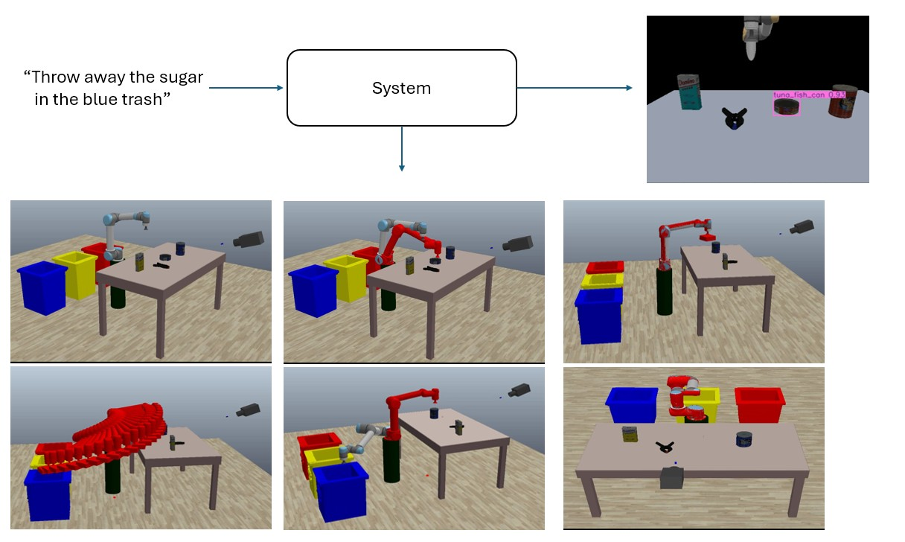

# Text2Arm: Natural Language & Computer Vision-Driven Robotic Manipulation




## Introduction

**Text2Arm** enables intuitive robotic control through natural language inputs. The system interprets user commands via an LLM, detects objects with YOLOv8, and executes precise robotic manipulations using inverse kinematics and path planning. 

## Installation

### Prerequisites
- Python 3.9+
- Conda
- CoppeliaSim 4.8.0+

Setup worked on a windows, cuda 11.8, RTX 4060 8GB VRAM. 

### Setup
```bash
conda env create -f environment.yml
conda activate robot
```

## Usage

1. **Start CoppeliaSim** and load the provided scene.
2. **Run the main script**:
```bash
python main.py [--use_cached_paths] [--vis_path] [--vis_yolo]
```
   - `--use_cached_paths`: Use precomputed motion paths to speed up execution.
   - `--vis_path`: Visualize planned paths before execution.
   - `--vis_yolo`: Display YOLO object detection output.

3. **Enter commands** in the terminal, e.g.,
   ```
   Move the tuna can to the red bin
   ```
   or type `detect` to visualize detected objects.

## System Overview

1. **User Input**: User provides a command, e.g., _"Move the tuna can to the red bin."_
2. **LLM Processing**: The fine-tuned LLM converts the input into structured object-location pairs.
3. **Object Detection**: YOLOv8 detects the specified objects.
4. **Path Planning & Execution**: The robotic arm follows a planned trajectory.


## Components

- **LLM**: Fine-tuned Flan-T5 Base model.
- **YOLOv8**: Object detection trained on the YCB dataset.
- **6-DOF UR5 Robotic Arm**: Controlled using inverse kinematics.
- **CoppeliaSim**: Simulation environment.

## Video Demo
[](https://www.youtube.com/watch?v=CFXh_Qk3UeE)

## References
- [Fine-Tuning Guide](https://github.com/Rami-Si7/Fine-Tune-on-LLM)
- [YCB Tools](https://github.com/sea-bass/ycb-tools)
- [OMPL Documentation](https://ompl.kavrakilab.org/)


For more information check out the `Text2Arm.pdf` report paper.
